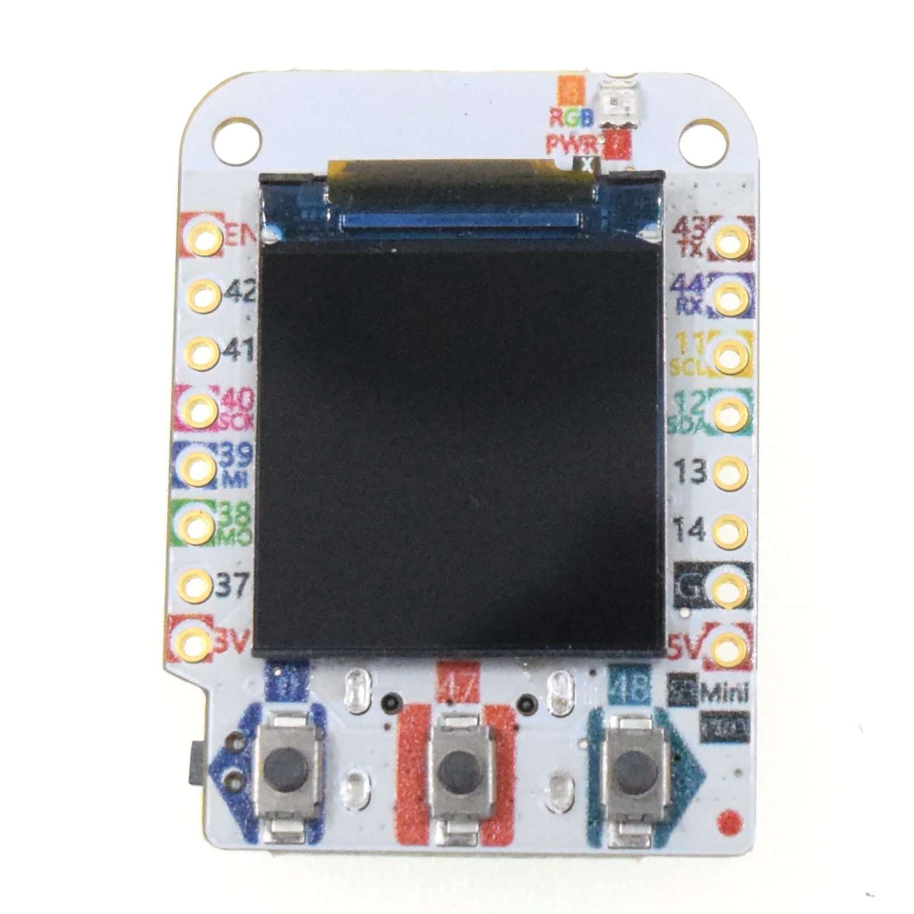
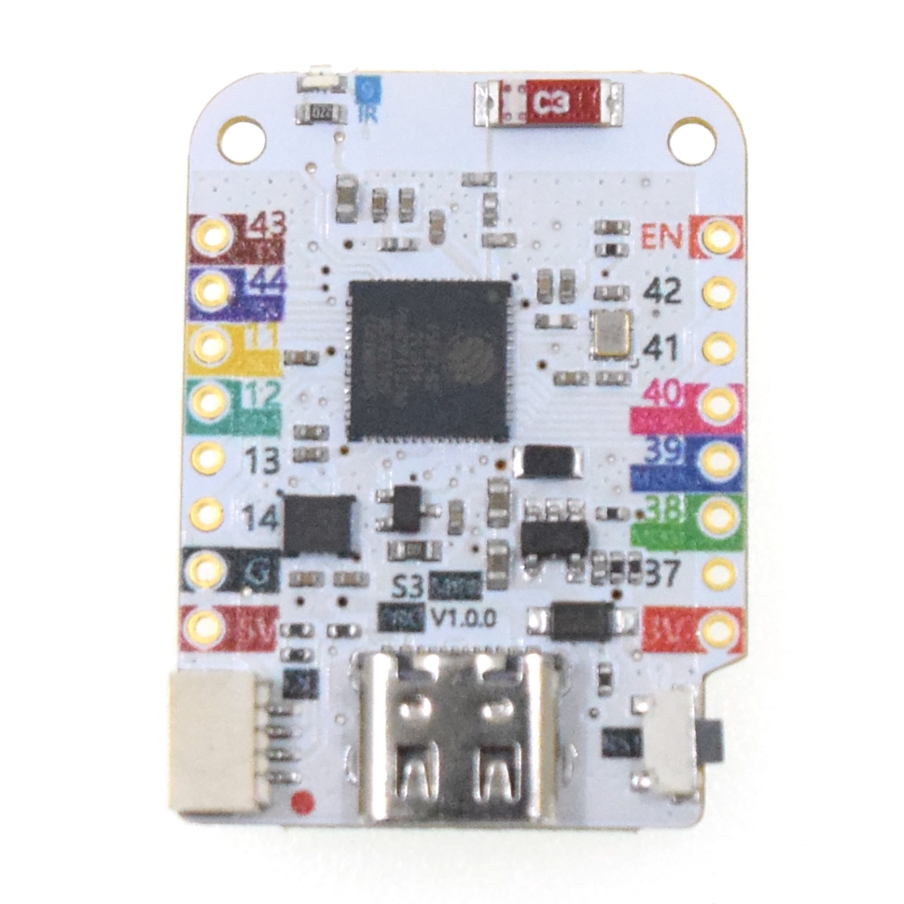
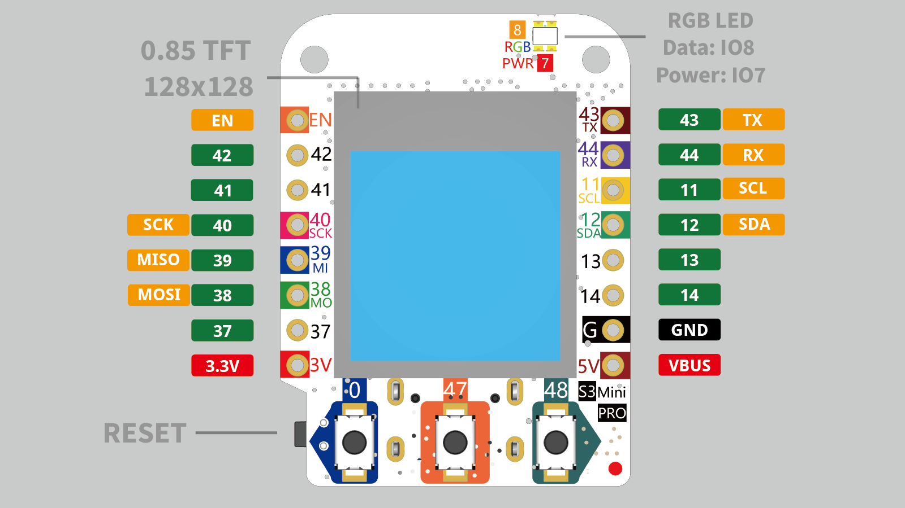
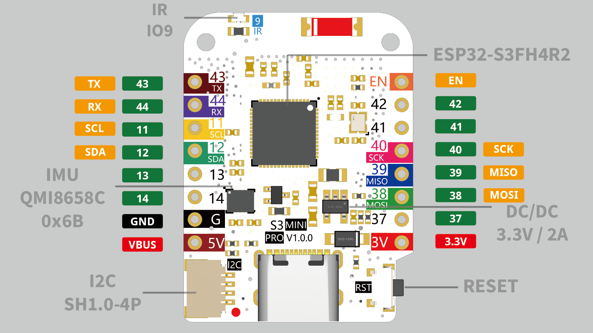

# S3 MINI PRO

 

## Features

* based ESP32-S3FH4R2
* 2.4 GHz Wi-Fi
* Bluetooth LE
* 4MB Flash
* 2MB PSRAM
* 0.85” 128x128 LCD TFT display (GC9107/GC9A01)
* 6D MEMS IMU (QMI8658C)
* 12x IO
* 3x Button (IO0, IO47, IO48)
* 1x RGB LED (**Data:** IO8, **Power:** IO7)
* 1x IR (IO9)
* ADC, DAC, I2C, SPI, UART, USB OTG
* Compatible with MicroPython, Arduino and ESP-IDF
* Default firmware: MicroPython

## Documentation
----------------------

* [Schematic V1.0.0](sch_s3_mini_pro_v1.0.0.pdf)
* [Dimension V1.0.0](dim_s3_mini_pro_v1.0.0.pdf)
* [ESP32-S3 Datasheet](esp32-s3_datasheet_en.pdf)

## Technical specs

* Operating Voltage: 3.3V  
* Digital I/O Pins: 12
* Clock Speed:  240MHz
* Flash: 4M Bytes 
* PSRAM: 2M Bytes
* Size: 34.3 x 25.4mm
* Weight: 5g

## Pin

doc: https://www.wemos.cc/en/latest/s3/s3_mini_pro.html

| Constant  | Pin  |
|-----------|------|
|           |      |
| **SPI**   |      |
| SPI_MOSI  | 38   |
| SPI_MISO  | 39   |
| SPI_CLK   | 40   |
|           |      |
| **TFT**   |      |
| TFT_BL    | 33   |
| TFT_DC    | 36   |
| TFT_CS    | 35   |
| TFT_RST   | 34   |
|           |      |
| **I2C**   |      |
| I2C_SDA   | 12   |
| I2C_SCL   | 11   |
|           |      |
| **RGB**   |      |
| RGB_POWER | 7    |
| RGB_DATA  | 8    |
|           |      |
| **IR**    |      |
| IR        | 9    |
|           |      |
| **BUTTON**|      |
| BUTTON0   | 0    |
| BUTTON47  | 47   |
| BUTTON48  | 48   |

