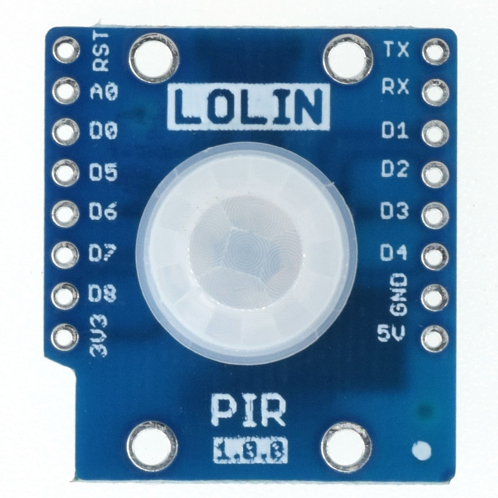
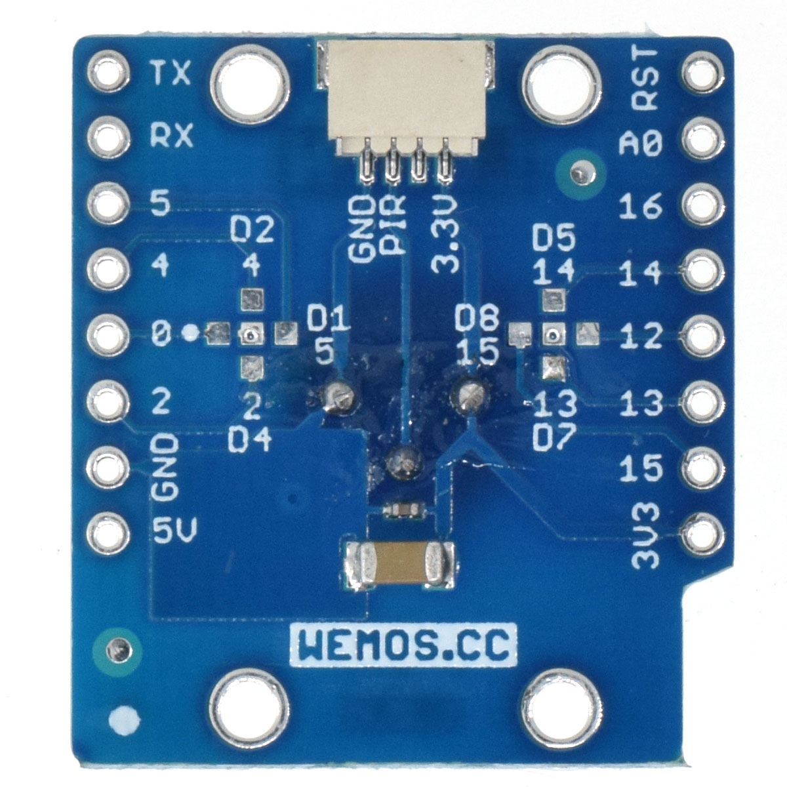

# PIR Shield

Passive infrared sensor shield.

# Features

* Configurable IO (Default: D3/IO13)
* Φ2mm mounting holes

# Pins

IO13

# Documents

* [Schematic v1.0.0](files/sch_pir_v1.0.0.pdf)
* [Dimension v1.0.0](files/dim_pir_v1.0.0.jpg)
   

