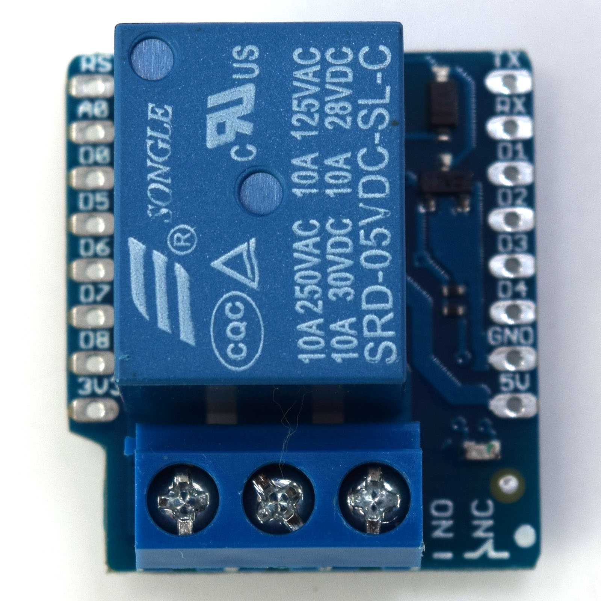
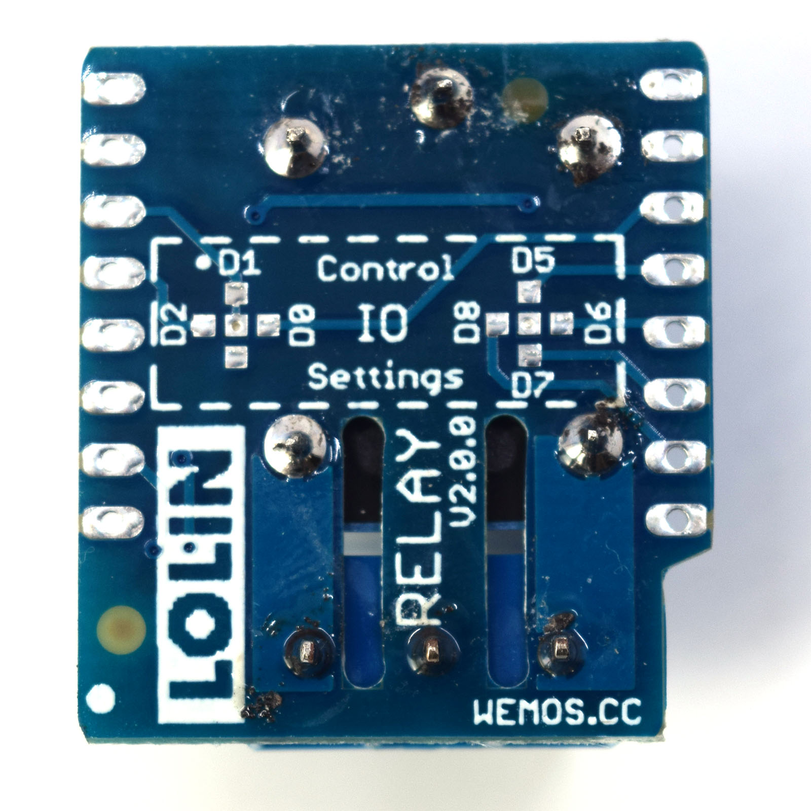

# Relay Shield

Simple relay shield.

## Features

* **NO:** 5A(250VAC/30VDC), 10A(125VAC), MAX:1250VA/150W
* **NC:** 3A(250VAC/30VDC), MAX:750VA/90W
* 7 configurable IO, default: D1, colides with I2C bus

## Pins

Changed to IO41

## Documents

* [Schematic v2.0.0](files/sch_relay_v2.0.0.pdf)

