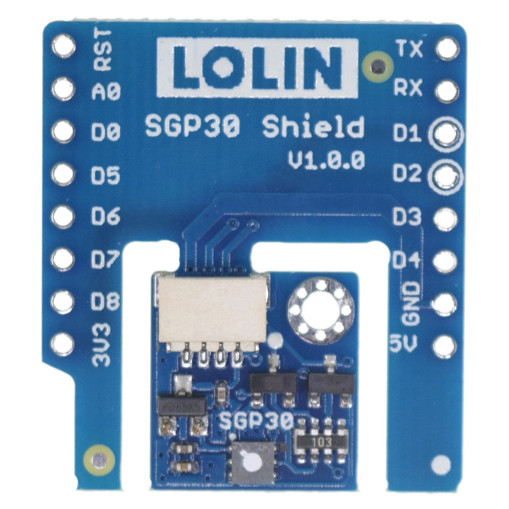
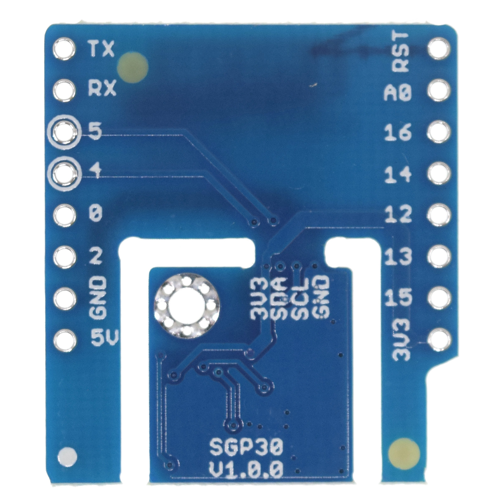

# SGP30 Shield

## Features

* I2C Interface
* TVOC: 0-60000 ppb
* eCO2: 400-60000 ppm
* Separable design
* Φ2mm mounting holes

## Pins

I2C bus. address

## Documents

* [Schematic v1.0.0](files/sch_sgp30_v1.0.0.pdf)
* [SGP30 Datasheet](files/datasheet_sgp30)

## Library

