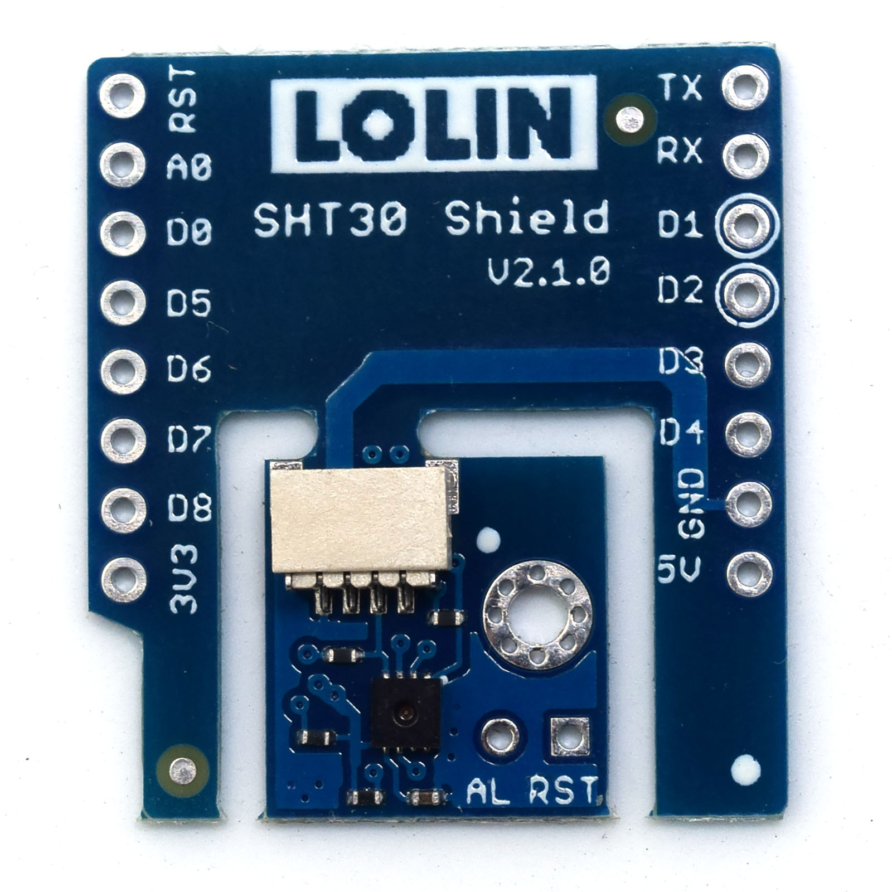
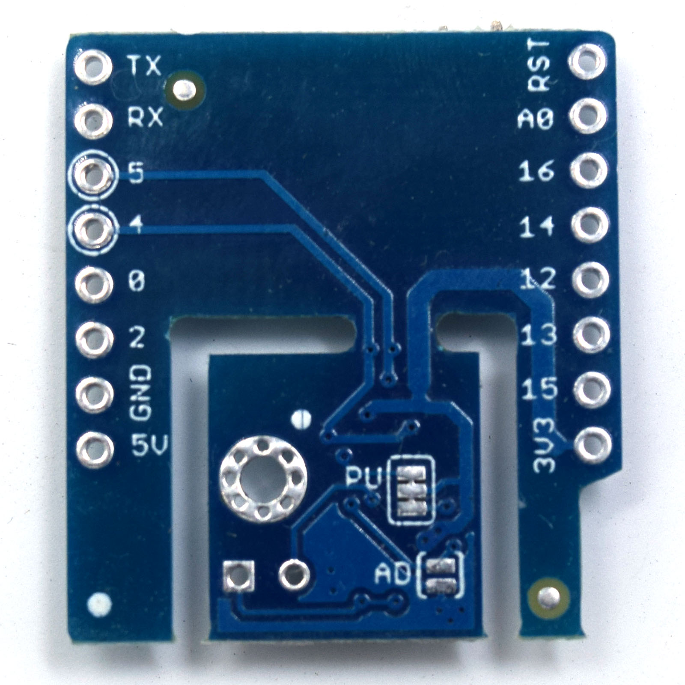

# SHT30 Shield

I2C Interface digital temperature and humidity sensor shield based SHT30.

## Features

* I2C Interface
* Two user selectable addresses
* Typical accuracy ±3%RH and ±0.3°C
* Separable design
* Φ2mm mounting holes

Pins

I2C bus, address 0x45

## Documents

* [Schematic v2.1.0F](files/sch_sht30_v2.1.0.pdf)
* [SHT30 Datasheet](files/sht30-dis_datasheet.pdf)

## Library

